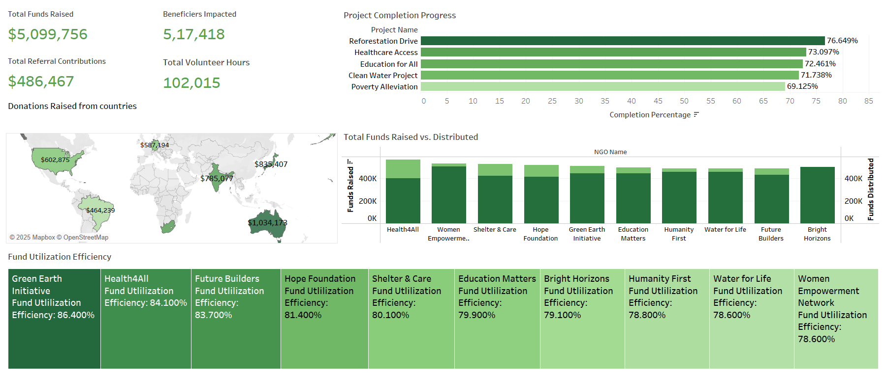
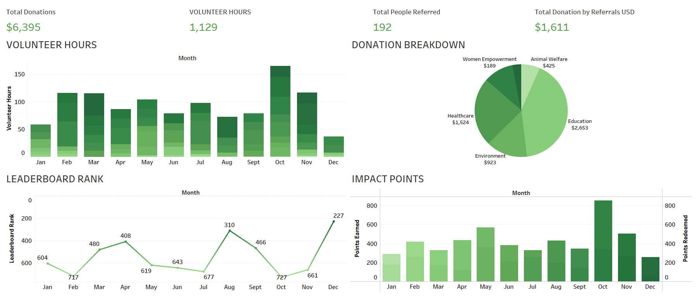
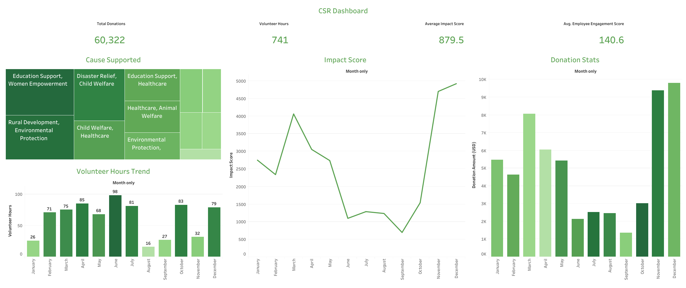
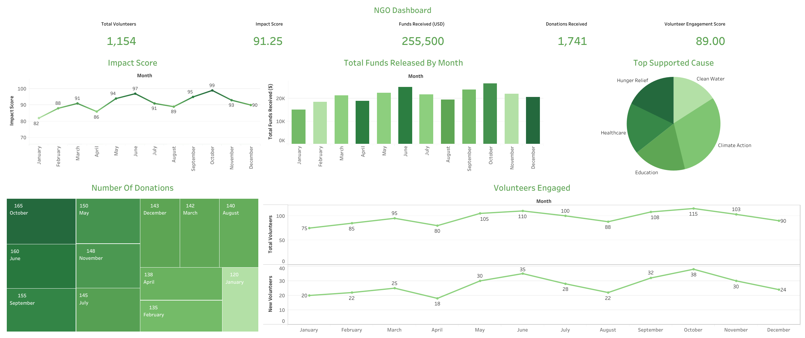

# 🌟 Impact Dashboards

This repository contains four Tableau-based dashboards built for showcasing and tracking social impact: the Public Transparency Dashboard, the Single User Dashboard, the CSR Dashboard, and the NGO Dashboard. These dashboards are based on sample data as the platform is still in development.
---

## 🌍 Public Transparency Dashboard

### 🎯 Purpose  
To offer a real-time, transparent view into the collective impact of our future platform. This dashboard is designed to build trust with external stakeholders by visualizing key performance indicators.

### 👤 Target Audience  
- Donors and Philanthropists  
- NGO & CSR Partners  
- Media, Auditors, and General Public  

### 📊 Features  
- Total Donations (Sample): $6,395  
- Volunteer Hours (Sample): 1,129 hrs  
- People Referred (Sample): 192  
- Referral-Based Donations: $1,611  
- Donation Breakdown by Cause:  
  - Education: $2,653  
  - Healthcare: $1,524  
  - Environment: $923  
  - Animal Welfare: $425  
  - Women Empowerment: $189  
- Volunteer Hours Trend (monthly stacked bar chart)  
- Impact Points vs. Points Redeemed  
- Leaderboard Rank Over Time  

---

## 👤 Single User Dashboard

### 🎯 Purpose  
To help individual users track their contributions and see how they rank compared to peers. It aims to promote personal motivation through gamification and feedback loops.

### 👤 Target Audience  
- Volunteers  
- Students & Corporate Participants  
- Community Contributors  

### 📊 Features  
- Monthly Impact Points for user vs. two sample users (Alice & Bob)  
- Leaderboard Rank Comparison  
- Clear visibility into performance spikes (e.g., user’s peak in October)  
- Rank fluctuations visualized across months (June–December)  

---

## 🧪 Data Source  
⚠️ All data used in these dashboards is arbitrary and simulated.  
These visualizations serve as prototypes for the client's upcoming platform, currently under development.

---

## 🧭 Dashboard Overview  

| Feature                  | Public Transparency Dashboard | Single User Dashboard       | CSR Dashboard                    | NGO Dashboard                      |
|--------------------------|-------------------------------|-----------------------------|----------------------------------|-----------------------------------|
| **Audience**             | Public Stakeholders           | Individual Users            | Internal Corporate Stakeholders | NGO Teams & Donors                |
| **Scope**                | Aggregated Platform View      | Personal Performance View   | Cause-level + Temporal Trends   | Operational & Volunteer Metrics   |
| **Purpose**              | Transparency & Trust          | Motivation & Benchmarking   | Impact Measurement & Engagement | Transparency & Performance Track  |
| **Visualization Style**  | Sectoral & Timeline-Based     | Peer Comparison & Trends    | Trendlines, Treemaps, KPIs      | Bar Charts, Pie Charts, Timelines |

---

## 🖼️ Dashboards Preview

### 🧮 Public Transparency Dashboard  

### 👤 Single User Dashboard  

### 📈 CSR Dashboard  

### 🧾 NGO Dashboard  

